# SSH Brute-Force Detection with Splunk SIEM

A complete SOC lab simulating SSH brute-force attacks against a Linux server, with real-time detection, dashboards, and forensic analysis using Splunk Enterprise.

Built as a hands-on cybersecurity portfolio project to demonstrate understanding of attacker tactics, defensive monitoring, and SIEM operations.

---

## Project Overview

This project implements a 3-VM lab environment that:

- **Simulates a realistic brute-force attack** against an SSH server using Metasploit and a custom wordlist derived from the RockYou password leak
- **Captures all authentication events** via Splunk Universal Forwarder
- **Detects attacker activity** through Splunk SIEM with custom SPL queries
- **Visualizes the attack** in a real-time SOC monitoring dashboard
- **Identifies successful compromises** through correlation of failed and accepted login events

The lab faithfully reproduces the dynamics of a basic credential-based attack and the corresponding defensive workflow used in Security Operations Centers.

---

## Architecture

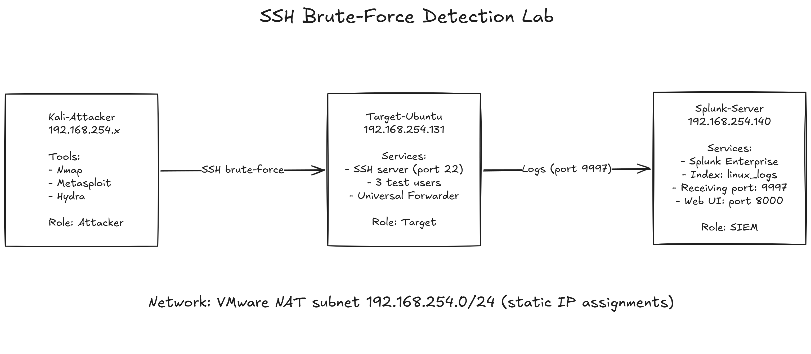

**Network:** All VMs reside on the same VMware NAT subnet (192.168.254.0/24) with static IP assignments for stability.
---

## Tech Stack

| Component | Technology | Purpose |
|---|---|---|
| Hypervisor | VMware Workstation | Virtual lab infrastructure |
| Attacker OS | Kali Linux 2025.x | Penetration testing toolkit |
| Target OS | Ubuntu Server 24.04 LTS | Vulnerable SSH host |
| SIEM OS | Ubuntu Server 24.04 LTS | Splunk host |
| SIEM | Splunk Enterprise 10.2.3 | Log indexing and analysis |
| Log Forwarder | Splunk Universal Forwarder 10.2.3 | Log shipping agent |
| Reconnaissance | Nmap 7.98 | Port and service discovery |
| Brute-force | Metasploit Framework 6.4 | Attack execution |
| Wordlist | RockYou (top 500 + 2 manual) | Password dictionary |

---

## Lab Setup

### Target-Ubuntu Configuration

Created three test users with intentionally weak passwords to simulate a misconfigured production system:

| Username | Password | Role |
|---|---|---|
| testuser1 | password123 | Standard user |
| admin | admin123 | Admin user |
| support | qwerty | Support user |

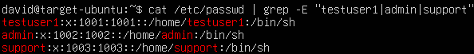

The PAM `pam_pwquality.so` dictionary check was disabled to allow weak passwords for lab purposes. **This must never be applied to production systems.**

### Network Configuration

Static IP addresses assigned via Netplan on both Ubuntu servers to ensure stable connectivity for the Universal Forwarder pipeline.

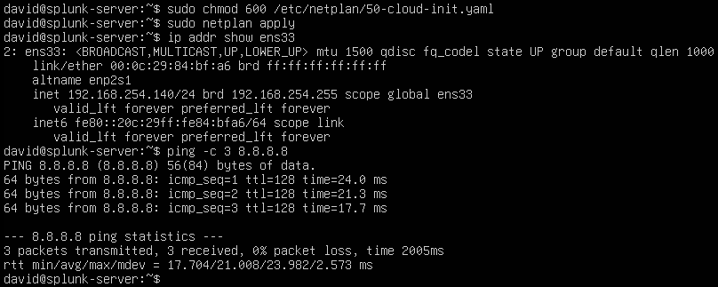

### Pre-Attack Verification

Network connectivity and SSH service availability verified from the attacker VM:

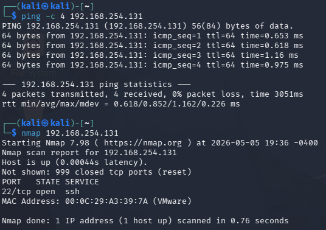

---

## Splunk SIEM Setup

Splunk Enterprise was installed on a dedicated VM and configured to:

1. Run as a non-privileged `splunk` user (security best practice)
2. Listen for forwarder connections on port **9997**
3. Index incoming Linux authentication logs into a dedicated index `linux_logs`

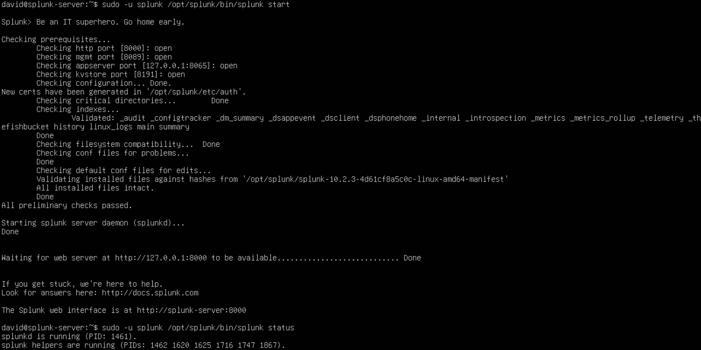

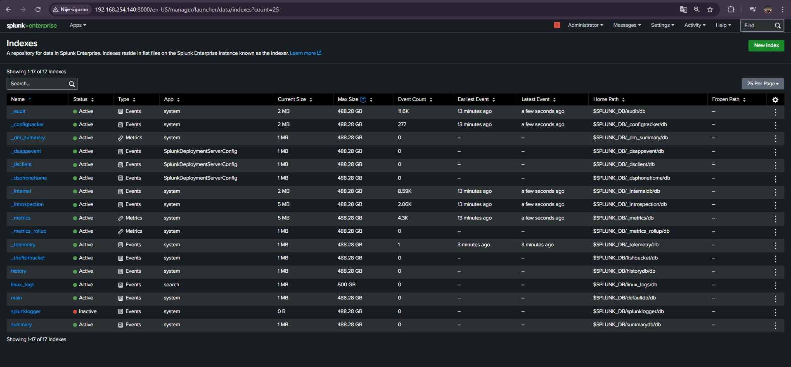

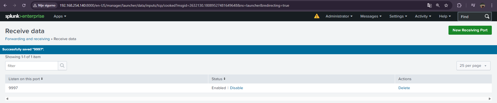

---

## Universal Forwarder Pipeline

The Universal Forwarder was deployed on the Target-Ubuntu host to ship `/var/log/auth.log` events in real time to the Splunk server.

**Configuration:**
- Forwarder runs as dedicated `splunkfwd` user
- Member of `adm` group for log read permissions
- `outputs.conf`: forwards to `192.168.254.140:9997`
- `inputs.conf`: monitors `/var/log/auth.log` with sourcetype `linux_secure`
- Registered as a systemd service for automatic startup on boot

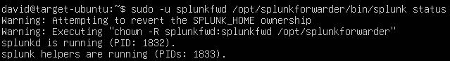

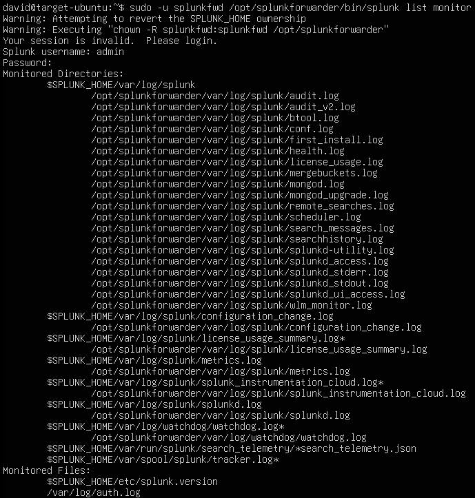

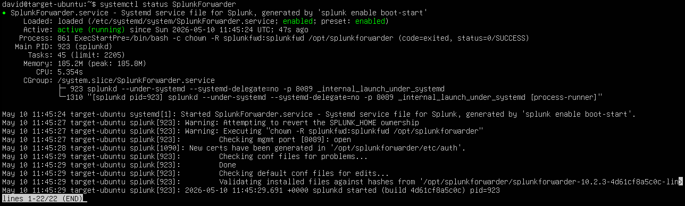

End-to-end pipeline verified by observing baseline events arriving in Splunk:

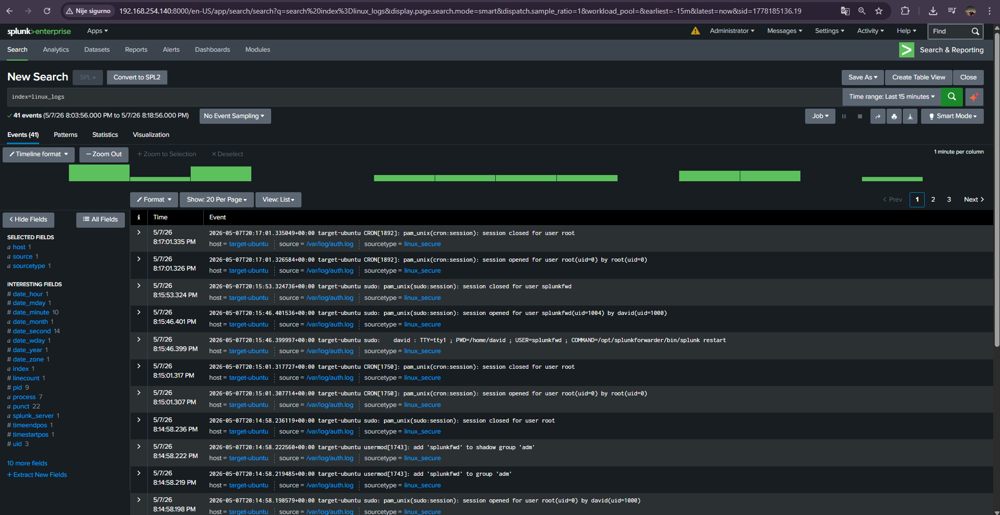

---

## Attack Execution

### Reconnaissance Phase

Nmap service version scan to identify the SSH attack surface:

```bash
nmap -sV -p 22 -oN nmap-recon.txt 192.168.254.131
```

Result: OpenSSH 9.6p1 on Ubuntu 24.04, no known exploitable CVEs at the protocol level — confirming brute-force as the most viable attack vector.

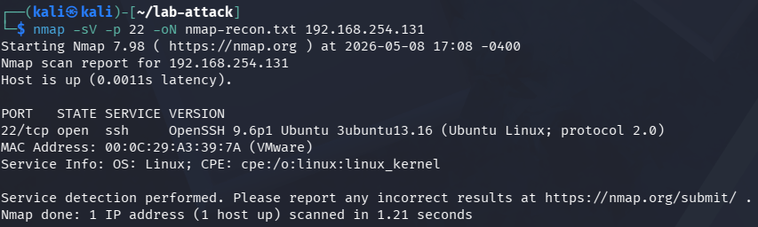

### Wordlist Preparation

Custom subset built from RockYou:

```bash
gunzip -k -c /usr/share/wordlists/rockyou.txt.gz > rockyou.txt   # 14.3M passwords
head -n 500 rockyou.txt > passwords.txt                          # Top 500
echo "password123" >> passwords.txt                              # Manually added
echo "admin123" >> passwords.txt
```

`admin123` lives at position 90,006 in RockYou and `password123` at 1,384 — both outside the top 500. Adding them manually simulates a **targeted attacker** with prior intelligence about the target's password patterns.

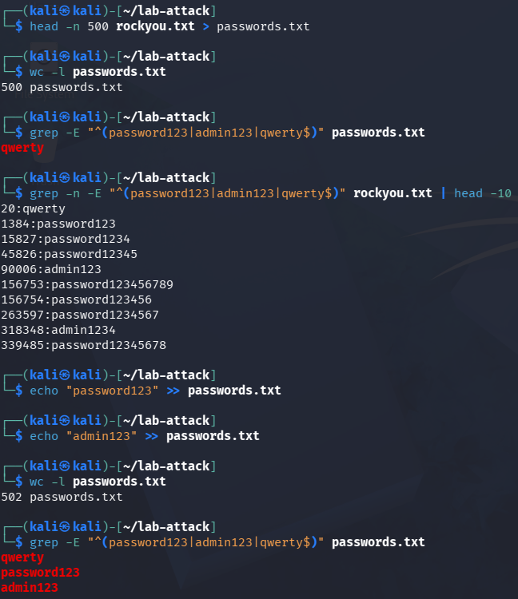

### Brute-Force Attack

Used Metasploit's `auxiliary/scanner/ssh/ssh_login` module against 7 usernames × 502 passwords = 3,514 attempts.

**Module configuration:**
- RHOSTS: 192.168.254.131
- USER_FILE / PASS_FILE: custom wordlists
- THREADS: 4
- STOP_ON_SUCCESS: false (to capture full attack volume in logs)
- VERBOSE: true

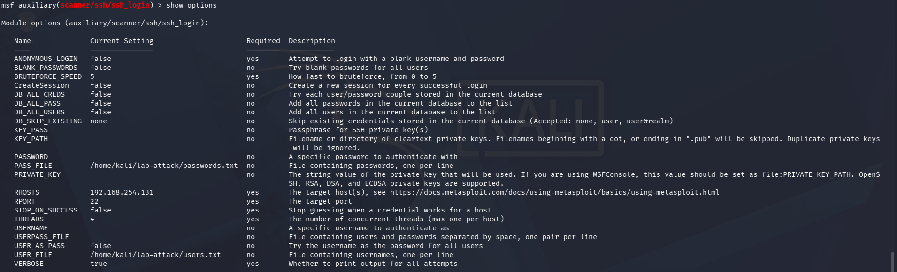

Attack in progress:

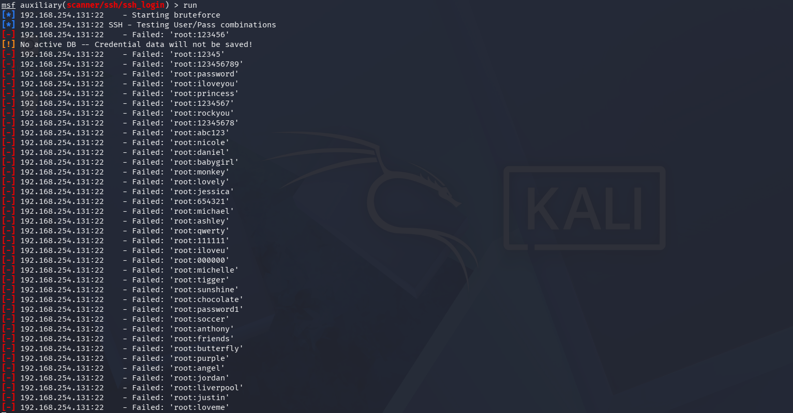

**Result: All three real users compromised.**

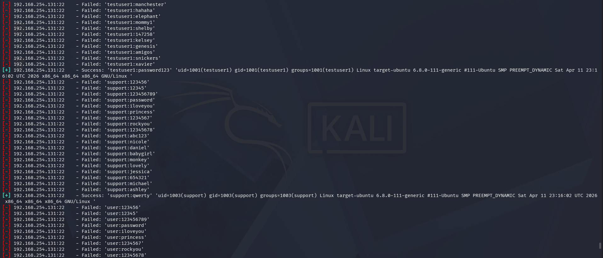

The attack ran for **84 minutes**, generating **1,664 failed login events** before three successful credential matches were achieved.

---

## Detection in Splunk

### Failed Authentication Events

Real-time visibility into the attack as it unfolded:

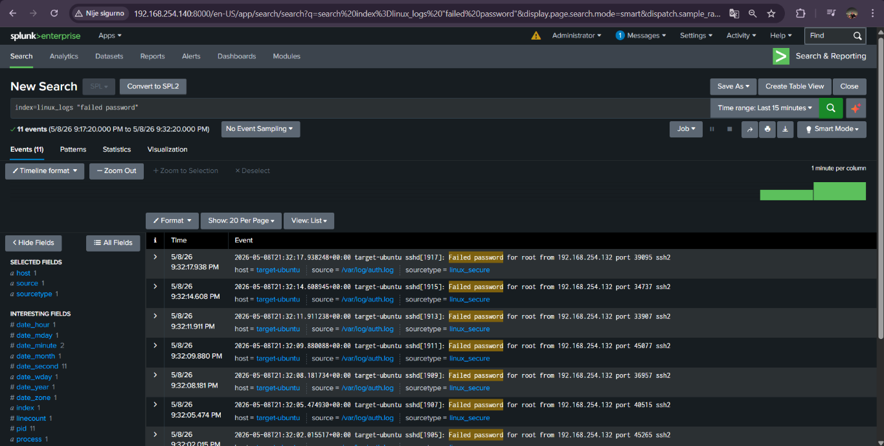

### Attack Pattern Visualization

Timechart showing the consistent ~20 failed attempts per minute — a clear brute-force signature:

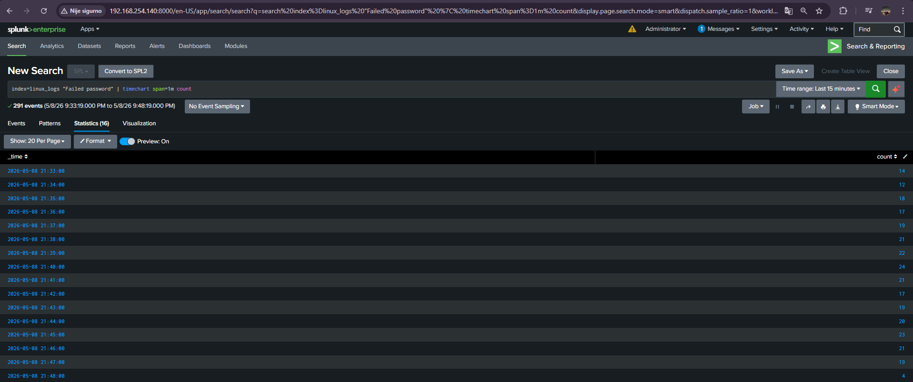

### Compromise Detection

The three successful logins captured from the attacker IP — the moment of compromise:

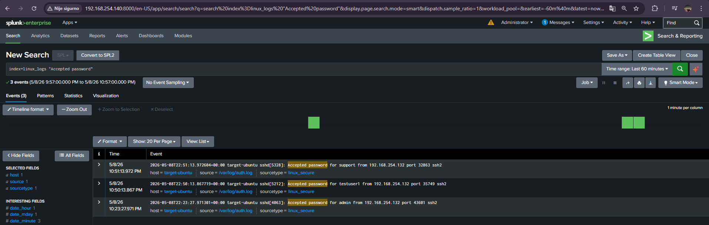

### Authentication Summary

Per-user breakdown showing failed counts before each successful breach:

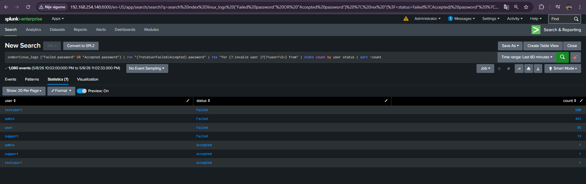

Notable insight: `support` was compromised after only 19 attempts (`qwerty` is at position 20 in RockYou), while `testuser1` required all 500 attempts plus the manually added `password123`.

### Attack Timeline

Total attack duration extracted via SPL:

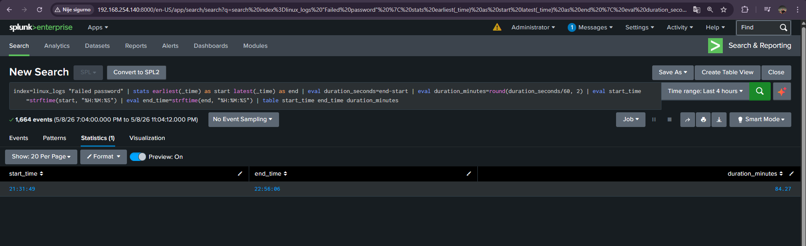

---

## SOC Monitoring Dashboard

A six-panel Splunk dashboard provides a real-time SOC view of brute-force activity:

1. **Total Failed Logins** (single value, color-coded)
2. **Successful Logins** (single value — the alert metric)
3. **Attack Timeline** (column chart, 1-minute granularity)
4. **Top Attacker Source IPs** (bar chart)
5. **Top Targeted Users** (pie chart)
6. **Authentication Summary** (table)

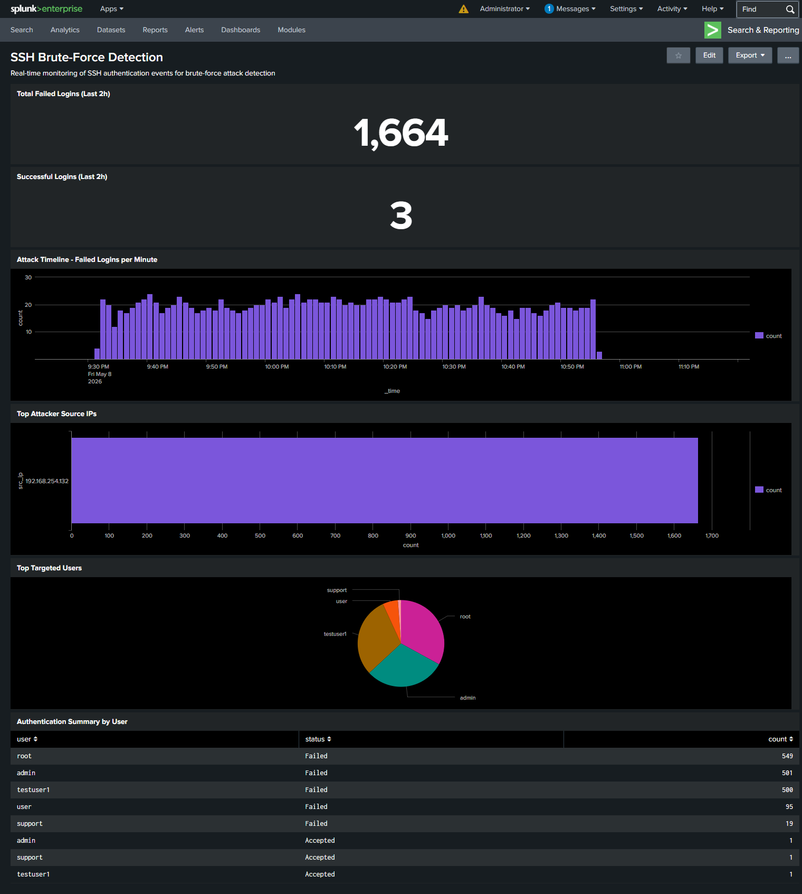

The dashboard immediately tells the story to any analyst: 1,664 failed logins from a single IP in 84 minutes against multiple usernames, followed by 3 successful authentications from the same source — an active compromise.

---

## MITRE ATT&CK Mapping

| Technique ID | Name | Activity in Lab |
|---|---|---|
| T1046 | Network Service Scanning | Nmap port and service version scan |
| T1110.001 | Brute Force: Password Guessing | Metasploit `ssh_login` against multiple accounts |
| T1078 | Valid Accounts | Successful credential authentication post-brute-force |

These three techniques are the standard adversary behaviors observed in the most common opportunistic attacks against internet-exposed SSH services.

---

## Detection Capability Summary

The lab demonstrates three layers of detection logic:

**Volume-based detection:** failed login spikes from a single source IP exceed a threshold (e.g., > 50 in 5 minutes).

**Pattern-based detection:** multiple distinct usernames attempted from the same source IP within a short window — strong enumeration signal.

**Behavioral detection:** failed logins followed by accepted login from the same source IP — the highest-priority alert, indicating a successful compromise.

All three layers are visible in the dashboard data even without dedicated alert rules configured.

---

## Lessons Learned

A few things didn't go like I expected.

The brute-force was slower than I thought. I planned for 3-4 attempts per second, got around 20 per minute. Turns out OpenSSH throttles failed authentications. Free defense, basically.

Wordlist position mattered more than size. Support fell in 19 attempts because qwerty is at position 20 in RockYou. Testuser1 needed the full 500 sweep before password123 hit. Same wordlist, very different outcomes.

I assumed the linux_secure sourcetype would auto-parse src_ip and user but it didn't so I had to write rex regex extractions at search time to get them.

Forwarder couldn't read /var/log/auth.log initially. The file is syslog:adm with 640 permissions, so splunkfwd had to be added to the adm group. Took me a minute to figure out why logs weren't arriving.

Splunk warns about running as root now. I set up dedicated splunk and splunkfwd users for Enterprise and the Forwarder. Ten extra minutes, matches how you'd actually do it in production anyway.

---

## Future Improvements

- **Threshold-based alerting:** automated email/Slack alerts when failed logins exceed a defined rate per source IP
- **fail2ban integration on target:** demonstrate the difference detection makes when paired with active blocking
- **Low-and-slow attack simulation:** spread attempts across hours/days to test detection of more sophisticated adversaries
- **Compromised account behavioral detection:** add post-exploitation activity simulation and detection (T1059 Command and Scripting, T1098 Account Manipulation)
- **MITRE D3FEND mapping:** complement the offensive ATT&CK mapping with corresponding defensive countermeasures
- **Compliance overlay:** map detection capabilities to ISO 27001 Annex A.12.4 (Logging and Monitoring) and NIS2 Article 23 incident reporting requirements

---

## Repository Structure

```
ssh-bruteforce-detection-splunk/
├── README.md
├── screenshots/
│   ├── 01-infrastructure/
│   ├── 02-splunk-setup/
│   ├── 03-forwarder-setup/
│   ├── 04-attack-execution/
│   └── 05-detection-dashboard/
├── splunk-queries/
│   └── spl-detection-queries.md
├── attack-files/
│   └── metasploit-resource.rc
└── docs/
└── lab-setup-notes.md
```

---

**Author:** David Sedlan  
Final-year IT undergraduate, FOI Varaždin  
Built May 2026
